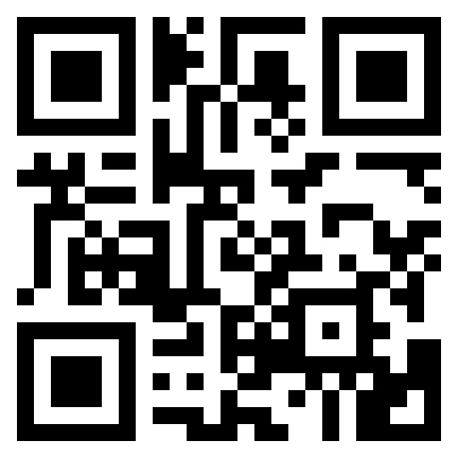

# *the Open Fuego Workshop @ C&W*
***An introduction to Open Fuego and basic coding*** 

**Stephen Quigley, University of Pittsburgh, [sjq4@pitt.edu](sjq4@pitt.edu)**

&nbsp;

### https://bit.ly/3KUyYqQ

&nbsp;

## Workshop Goals

***Learn...***

* best practices for working with code in the rhetoric and composition classroom.

* how to use a code editor to work with code.

* how to build repositories and host sites using GitHub.

* how to find resources and support to sustain your learning. 
&nbsp;

## Proceedings 

* [What is Open Fuego?](https://sjquigley.github.io/Open-Fuego-Presentation/) - Software design and pedagogical goals.

* [Where do I find it?](https://open-fuego.github.io/Open-Fuego-Coding-Tools/) - Tool descriptions, demos, and links to GitHub repositories.

* [Steve's Code and Technology Narrative Example](https://sjquigley.github.io/My-code-and-technology-narrative/)- Build your own webtext with this introductory tool.

* [My Code and Technology Narrative](https://github.com/Open-Fuego/code-and-technology-narrative)- Build your own webtext with this introductory tool.

* [Open Fuego Webtext Generator](https://github.com/Open-Fuego/open-fuego-webtext-generator)- Preview this code-based webtext generator. 

* [Workshop Feedback](https://docs.google.com/forms/d/e/1FAIpQLSffIR6Cml15Gz_4Enxp39Pq3ynN9ivYxCeZTf3J5Q8e9NZsWg/viewform?usp=sf_link) - I'd love to learn a little about how that went. 
&nbsp;

## Additional Resources
- [Best Practices for Collaborating on GitHub](https://github.com/sjquigley/GitHub-in-the-Tech-Comm-Classroom) - Tools/strategies for teaching collaboration on GitHub. 
- [W3](https://www.w3schools.com) - Provides a wide range of code reference, tutorials, and a sandbox allowing code play.
- [Stack Overflow](https://stackoverflow.com) - Code questions and aggregated answers.
- [MarkDown Reference](https://daringfireball.net/projects/markdown/) - Write Markdown like a pro. 
&nbsp;

## Code editors 

You have a range of code editor options depending on your operating system, but we recommend [Phoenix Code](https://phcode.dev) because it works across all operating systems, it comes with HTML preview already installed, and it's free and open-source. You can download a version or use the online editor. 

### Phoenix Code (Free and Open-Source for Mac / Windows / Linux. Download or use Online)

1. Go to [Phoenix Code](https://phcode.dev). 
1. Use the online version or [download](https://phcode.io/#/home) a desktop app for Mac, Windows, Linux. 
1. Adjust text wrapping, select **View>Word Wrap**
1. Enjoy the live preview.
&nbsp;

&nbsp;

### Pulsar (Free and Open-Source for Mac / Windows / Linux)
[See Video Tutorial](https://youtu.be/dKcJm4V53ig)

1. Download "**[Pulsar](https://pulsar-edit.dev)**" Pulsar comes with "Spell Check" already installed. 
1. Add HTML Preview 
	* from the dropdown menu, select **Packages>Open Package Manager**
	* select **+ Install**
	* in the search bar type "**Atom-HTML-preview**." 
	* select the package built by "**HARMSK**." Click "**Install**."
1. Adjust text wrapping 
	 -	from the dropdown menu, select **View>Toggle Soft Wrap** (this will force lines of code to conform to your view tab.)

&nbsp;

&nbsp;

### Visual Studio Code (Mac / Windows /Linux)
[See Video Tutorial](https://youtu.be/1onqFbSgeQo)

1. Download "**[Visual Studio Code](https://code.visualstudio.com/download)**"
1. Add HTML Preview 
	* from the dropdown menu, select **View>Extension.**
	* In the search bar type "**Live Preview**." Install.
	* Right click on the index.html tab and select "**show preview**." You should see a live version of your work.
1. Install Spell Check 
	* from the dropdown menu, select **View>Extension.** 
	* In the search bar type "**Code Spell Check**." Install.
1. Adjust text wrapping on index.html 
	* from the dropdown menu, select **View>Word Wrap** (this will force lines of code to conform to your viewer tab.)
&nbsp;

&nbsp;

## Best Practices for Working with Code in the Classroom

* *Yep...Work with Code* – most all of the code your students will need to write has already been written. Encourage students to work with code, not write it. (Disagree? See our final entry)

* Admit ignorance – your students will be much more responsive to learning about code and computer science when they realize that their teachers are also learners.

* Be flexible – there are many solutions to any given problem. Use difference as an opportunity to engage learning, asking questions, and assessing quality in different circumstances.

* Don’t fix things for your students – teach students to learn how to learn by directing them to the right resources.

* Promote online learning spaces – most of the questions and answers we seek have already been discussed somewhere on the internet. Encourage students to discover and contribute to these spaces on sites like GitHub and Stack Overflow, and to use other learning spaces like W3.

* Leverage classroom knowledge – acknowledging your own limitations will encourage students who may possess more knowledge than you to speak up and take leadership roles.

* Set Deadlines, but be flexible – give your students all the time they need to figure out how to work with code. Demand excellence, but ensure learning.

* Think Small Groups – small groups provide a great way to help students learn to connect with the other through code.

* Offer Debugging Sessions – students will often arrive to class with big problems that require simple solutions. Allow students time to meet in small groups to solve their coding problems.

* Utilize Small Group Presentations - presenting work in small groups takes the pressure off of presenting in larger ones. They also allow students to ask more questions and learn more about their own learning.

* Group Share - After small group presentations, require each group to share-out the highlights of their experience, not only sharing what they made, but what they learned.

* Build Confidence – Be proud of your students! Encourage them to continue working with code and learning new technologies.

* Teach to Transfer - Offer plenty of time for students to assess what they learned and to process how they learned it. Focus on aspects of rhetoric, writing, and computational thinking that will transfer into other applications.

* Promote Other Kinds of Coding Experience – It may be unrealistic to learn more than Pitt Fuego in your classroom, but that doesn’t mean you shouldn’t encourage students to transfer their new knowledge and skills to learn more about code, even learning how to write their own.

**SAMPLE TEACHING CYCLE** (3 projects for any class)

* **Code Icebreaker** - Start your class with code. Combine the standard classroom introduction with code education. Students will present who they are, where they came from, what they do, and where they want to go. (see: [Electrate Fuego](https://github.com/Open-Fuego/Electrate-Fuego) or [I AM...a Project in Becoming.](https://github.com/Open-Fuego/I-am-a-project-in-becoming))

* **Stasis Theory Generator** - Students use code to work through the four questions of stasis: conjecture, definition, quality, and policy. (see: [Stasis Theory Machine](https://github.com/Open-Fuego/stasis-theory-machine), [Elevator Pitch Generator](https://github.com/Open-Fuego/elevator-pitch-generator))

* **Multimodal Communication Document** - Students use [Open Fuego Webtext Generator](https://github.com/Open-Fuego/open-fuego-webtext-generator) to make a mobile-ready multimodal communication document. 

&nbsp;

### References

Banks, A. J. (2006). Race, rhetoric, and technology: Searching for higher ground. Routledge.

Brown, J. (2015). Ethical programs: Hospitality and the rhetorics of software (p. 231). University of Michigan Press.

Brock, Kevin. (2019). Treating code as persuasive argument. in J. Jones & L Hirsu (Eds.), Rhetorical Machines: Writing, Code, and Computational Ethics (pp. 69-85). Tuscaloosa: University Alabama Press.

Byrd, Antonio. (2019). Between learning and opportunity: A study of African American coders’ networks of support. Literacy in Composition Studies, 7(2), 31-56.

Byrd, Antonio. (2020). Like coming home": African Americans tinkering and playing toward a computer code bootcamp. College Composition and Communication, 71(3), 426-452.

Gee, James P. (2013). The anti-education era: creating smarter students through digital learning. New York, NY: Palgrave Macmillan.

Holmevik, Jan R. (2012). Inter/vention: Free play in the age of electracy. Cambridge, MA: MIT Press.

Kern, Alfred. (1987). Basic writing: the student as programmer. ADE Bulletin, 86, 4–7.

Palmeri, Jason. (2012). Remixing composition: A history of multimodal writing pedagogy. Carbondale, IL: Southern Illinois University Press.

Pew Research Center. (2019). Mobile fact sheet. Pew Research. Retrieved March 26, 2021 from [https://www.pewresearch.org/internet/fact-sheet/mobile/](https://www.pewresearch.org/internet/fact-sheet/mobile/)

Quigley, Stephen J.. (2022). Basic coding. Kairos: A Journal of Rhetoric, Technology, and Pedagogy 26(2). Retrieved February 15, 2023, from [https://kairos.technorhetoric.net/26.2/disputatio/quigley/index.html](https://kairos.technorhetoric.net/26.2/disputatio/quigley/index.html)

Quigley, Stephen J., Esther Lui, Samantha Whelpley and Joseph Flot. (2022) Writing Infrastructures: GitHub in the Technical and Professional Communications Classroom. Reflections; A Journal of Community Engaged Writing and Rhetoric. Retrieved February 15, 2023, from [https://reflectionsjournal.net/2022/08/editors-introduction-finding-humanity-and-community-in-pandemic-scholarship-9/](https://reflectionsjournal.net/2022/08/editors-introduction-finding-humanity-and-community-in-pandemic-scholarship-9/)

Shaughnessy, Mina. (1976). Diving in: An introduction to basic writing. College Composition and Communication, 27(3), 234-239.

Shipka, Jody. (2011). Toward a composition made whole. Pittsburgh, PA: University of Pittsburgh Press.

Stolley, Karl. (2008). The Lo-fi manifesto. Kairos, 12(3). Retrieved November 12, 2020 from [http://kairos.technorhetoric.net/20.2/inventio/stolley/](http://kairos.technorhetoric.net/20.2/inventio/stolley/)

Stolley, Karl. (2012). Source literacy: A vision of craft. Enculturation: A Journal of Rhetoric, Writing, and Culture, 14. Retrieved November 12, 2020 from [http://enculturation.net/node/5271](http://enculturation.net/node/5271).

Turkle, Sherry., & Papert, Seymour. (1990). Epistemological pluralism: Styles and voices within the computer culture. Signs: Journal of women in culture and society, 16(1), 128-157.

Vee, Annette. (2017). Coding literacy: How computer programming is changing writing. Cambridge, MA: MIT Press.

Vee, Annette. (2019). Full stack rhetoric in J. Jones & L Hirsu (Eds.), Rhetorical Machines: Writing, Code, and Computational Ethics (pp. 237-244). Tuscaloosa, AL: University Alabama Press.

Wing, J. M. (2006). Computational thinking. Communications of the ACM, 49(3), 33-35.

&nbsp;

 

**Stephen Quigley, University of Pittsburgh, [sjq4@pitt.edu](sjq4@pitt.edu)**

